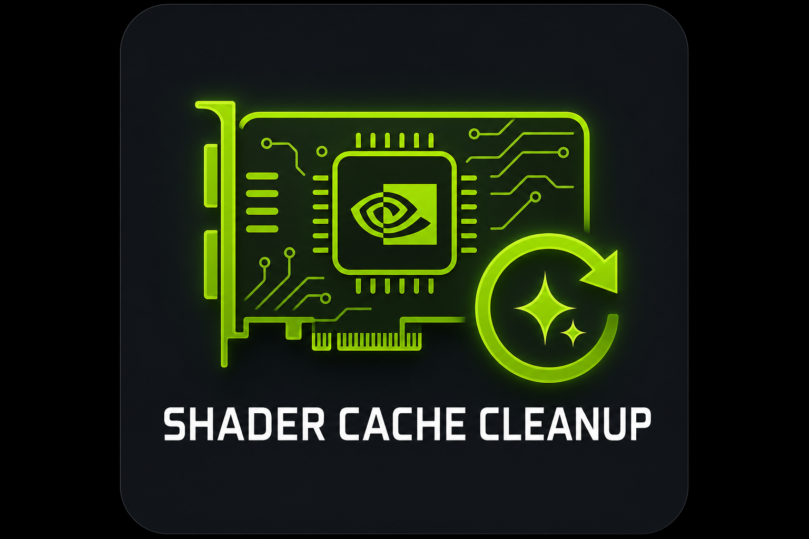

<div align="center">



# NVIDIA Shader Cache Cleanup

[](#requirements)
[](#requirements)
[](LICENSE)

</div>

A small Windows utility that clears the **NVIDIA** and **Windows DirectX/OpenGL shader caches** in one click.

Run it after installing a new GPU driver, or whenever games start **crashing on launch, stuttering, flickering, or showing visual artifacts**. The driver and Windows rebuild these caches the next time you launch each game.

---

## What is the shader cache?

When you run a game, your GPU driver compiles the game's shaders into binaries that match your exact GPU and driver version, then stores them on disk. On later launches the driver reuses those cached binaries so games load faster and stutter less.

Those files can go stale or get corrupted after a driver update or a game patch. When that happens you see crashes, hitching, or graphical glitches. Deleting the cache forces the driver to rebuild clean copies. Nothing important is lost, so saves, settings, and accounts are untouched. NVIDIA documents the same fix in [Deleting NVIDIA Shader Cache files](https://nvidia.custhelp.com/app/answers/detail/a_id/5735/).

> The first launch after a cleanup is meant to be slower while shaders recompile. That is normal and it happens once per game.

---

## What it does

1. Stops the NVIDIA background apps (NVIDIA App, overlay, ShadowPlay/Share, Broadcast, helpers) so they release their file locks.
2. Temporarily stops the NVIDIA container services, along with anything depending on them, so the caches those services hold open can be cleared. Your screen may flicker once while the display service restarts.
3. Finds every known shader cache folder and deletes its contents. The folders themselves are kept so the driver refills them in place.
4. Reports what was freed, per folder and in total.

The services are always restarted, even if the cleanup hits an error part way through, so the tool never leaves your machine with the display service stopped.

It does not touch your games, drivers, saves, or settings, and it skips any folder that does not exist.

---

## Cache locations cleared

The tool does not hard code full paths. It looks under the known NVIDIA roots for folders named `DXCache`, `GLCache`, `ComputeCache`, `OptixCache`, or `NV_Cache`, so new driver layouts such as `PerDriverVersion` are picked up without a code change. Nothing outside that name list is ever deleted.

Roots searched, per user profile plus the system and service profiles:

| Root | Holds |
| --- | --- |
| `%LOCALAPPDATA%\NVIDIA` | `DXCache`, `GLCache`, `ComputeCache`, `OptixCache` |
| `%LOCALAPPDATA%\NVIDIA Corporation` | Legacy `NV_Cache` |
| `%LOCALAPPDATA%Low\NVIDIA` | `DXCache` and the `PerDriverVersion` tree (driver 545.xx and newer) |
| `%APPDATA%\NVIDIA` | `ComputeCache` |
| `%ProgramData%\NVIDIA Corporation` | Legacy `NV_Cache` |
| `%TEMP%\NVIDIA Corporation` | Transient driver cache |
| `...\config\systemprofile\AppData\...` | Caches owned by the driver **service**, the reason admin rights are needed |
| `...\ServiceProfiles\LocalService\AppData\...` | Same, for the service account |

Also cleared:

| Path | Notes |
| --- | --- |
| `%LOCALAPPDATA%\D3DSCache` | Windows DirectX shader cache, any GPU |
| `%LOCALAPPDATA%\Microsoft\D3DSCache` | Alternate Windows location |
| `%__GL_SHADER_DISK_CACHE_PATH%\GLCache` | Only when you have moved the OpenGL cache with that NVIDIA variable |

Turn the Windows cache off with `-IncludeD3DSCache:$false` if you only want the NVIDIA ones.

---

## How to use

### Option A, download and run (recommended)

1. Go to the repository, click **Code, Download ZIP**, and extract it.
2. Open the `NvidiaShaderCleanup` folder.
3. Double-click **`NvidiaShaderCleanup.bat`**.
4. Approve the **User Account Control** prompt. Admin rights are required to clear the caches owned by the driver service.
5. Wait for `Cleanup Complete`, then press **Enter** to close.

### Option B, clone with Git

```bash
git clone https://github.com/Kkthnx/NvidiaShaderCleanup.git
cd NvidiaShaderCleanup/NvidiaShaderCleanup
```

Then double-click `NvidiaShaderCleanup.bat`.

> Close your games first. The tool stops the NVIDIA background processes for you, but a running game keeps its own cache files locked.

### Options

The launcher passes any arguments straight through, so `NvidiaShaderCleanup.bat -DryRun` works. You can also call the script directly:

```powershell
# Preview only. Shows what would be cleared and how much it would free, deletes nothing
.\NvidiaShaderCleanup.ps1 -DryRun

# Clear every local user profile, write a log, exit on its own
.\NvidiaShaderCleanup.ps1 -AllUsers -NoPause -LogPath .\cleanup.log
```

| Flag | Description |
| --- | --- |
| `-DryRun` | Preview mode. Reports what would be cleared without stopping anything or deleting files. |
| `-AllUsers` | Also clear every other local user profile, not just the current one. |
| `-IncludeD3DSCache:$false` | Leave the Windows DirectX shader cache alone. On by default. |
| `-SkipServices` | Do not touch any Windows service. Caches held open by the driver are then likely to be skipped. |
| `-SkipRebootSchedule` | Do not queue driver held files for deletion on the next reboot. |
| `-NoPause` | Skip the "Press Enter to exit" prompt. |
| `-LogPath <file>` | Write a full transcript of the run to that file. |
| `-WhatIf` | Standard PowerShell preview, same idea as `-DryRun`. |

Exit codes: `0` everything cleared, `1` one or more folders were only partly cleared, `2` a fatal error or a declined elevation prompt.

The script self-elevates if you run it without administrator rights.

---

## How this differs from NVIDIA's manual steps

NVIDIA's article tells you to set **Shader Cache Size** to **Off** in the NVIDIA App, reboot, delete the folders by hand, then turn the setting back on. That works because a rebooted machine with caching off is not holding the files open.

This tool takes the other route to the same place. It stops the processes and services that hold the handles, clears the folders, then puts the services back. No setting to remember to restore.

A small number of `.nvph` index files are held open by the kernel mode display driver itself. Nothing you can stop will release them, which is the real reason NVIDIA's steps involve a reboot. Rather than tell you to close games that are not running, the tool queues those files for deletion on your next reboot using the same `MoveFileEx` mechanism Windows installers use. They are a few files totalling a few megabytes. The bulk of the cache is cleared immediately.

If a file is genuinely stuck and cannot even be queued, the tool says so per folder and exits with code `1` rather than pretending it succeeded.

If you would rather follow NVIDIA's steps exactly, their article is linked above.

---

## Requirements

- Windows 10 or Windows 11
- An NVIDIA GPU and driver. The Windows DirectX cache is cleared either way.
- Windows PowerShell 5.1 (built in) or PowerShell 7 and newer
- Administrator rights, which the launcher requests for you

---

## Files

| File | Purpose |
| --- | --- |
| `NvidiaShaderCleanup/NvidiaShaderCleanup.bat` | Launcher. Requests admin rights and runs the script. Double-click this one. |
| `NvidiaShaderCleanup/NvidiaShaderCleanup.ps1` | The script that does the work. Can be run directly, it self-elevates. |

---

## FAQ

**Is it safe?**
Yes. It only deletes regenerable cache files, and only folders whose name is on a fixed list. Windows and the NVIDIA driver rebuild them on demand. Your games, saves, settings, and drivers are not modified. Run `-DryRun` first if you want to see the exact list for your machine before anything is deleted.

**Why does my screen flicker during the run?**
Restarting the NVIDIA Display Container service briefly resets the display. It comes back on its own.

**Why does a game stutter or load slowly right after I run this?**
Its shaders are being recompiled and re-cached. That happens once per game after a cleanup and then goes away.

**Do I need to set Shader Cache Size to Off first?**
No. The tool stops the NVIDIA processes and services instead, which releases the same locks. See the section above.

**It says files were queued for the next reboot.**
That is normal and it is not an error. Those few files are held by the display driver and can only go at boot. Reboot when convenient, or leave them, since the driver overwrites them anyway.

**It says a folder was only partly cleared.**
A game or background app still had files open there. Close your games and the NVIDIA App, then run it again.

**Does it work on AMD or Intel?**
The Windows DirectX cache part does. The NVIDIA folders simply will not exist, so they are skipped.

---

## License

[MIT](LICENSE) by Kkthnx
